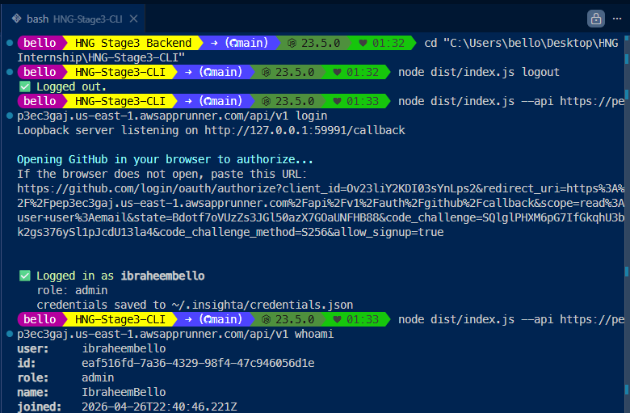
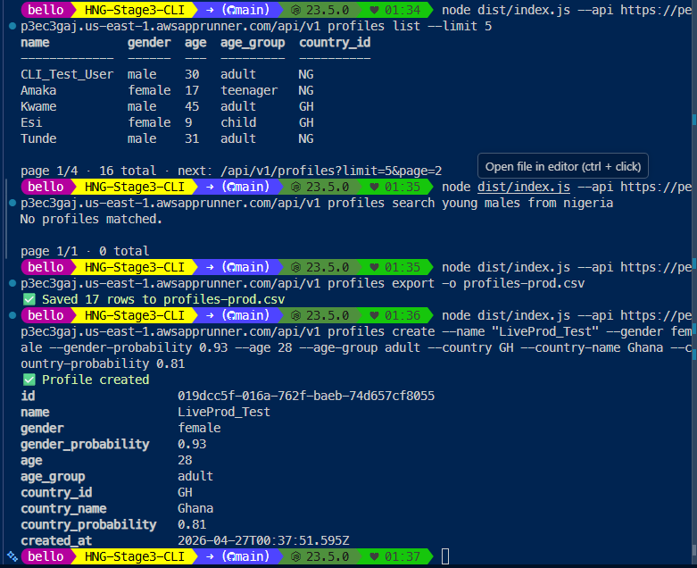

# Insighta CLI — `insighta`

> Globally installable terminal client for **Insighta Labs+**. GitHub OAuth + PKCE, profile queries, CSV export — directly from your shell.

[](https://github.com/ibraheembello/HNG-Stage3-CLI/actions/workflows/ci.yml)


## 📦 Sibling repositories

| Repo | Purpose |
|---|---|
| 💻 **HNG-Stage3-CLI** (this) | Globally-installable Node CLI |
| 🔵 [HNG-Stage3-Backend](https://github.com/ibraheembello/HNG-Stage3-Backend) | Express + Prisma API · OAuth + RBAC + CSV |
| 🌐 [HNG-Stage3-Web](https://github.com/ibraheembello/HNG-Stage3-Web) | Next.js + Tailwind web portal |

---

## 🚀 Live demo against the production AWS backend

| Login (OAuth + PKCE) | Full command sweep |
|---|---|
|  |  |

---

## ⚡ Install

### Globally from the cloned repo
```bash
git clone https://github.com/ibraheembello/HNG-Stage3-CLI.git
cd HNG-Stage3-CLI
npm install
npm run build
npm link            # registers `insighta` on your PATH
```

After this, `insighta` works from any directory.

### Run without installing globally
```bash
node dist/index.js <command>
# or during development
npm run dev -- <command>
```

---

## 🔑 First-time setup

```bash
insighta --api https://pep3ec3gaj.us-east-1.awsapprunner.com/api/v1 login
```

What happens:
1. CLI opens a one-shot loopback HTTP server on a random local port (`http://127.0.0.1:NNNNN/callback`).
2. CLI generates a fresh PKCE `code_verifier` and S256 `code_challenge`.
3. CLI calls `POST /auth/github` on the backend with the challenge + the loopback URL.
4. CLI opens your default browser to GitHub's authorize page.
5. After you click **Authorize**, GitHub redirects to the backend, which 302-redirects back to the CLI's loopback with `code` + `state`.
6. CLI exchanges the code (with the original `code_verifier`) at `POST /auth/github/cli/exchange`.
7. Tokens are saved to **`~/.insighta/credentials.json`** with mode `0600`.

```jsonc
// ~/.insighta/credentials.json — example shape
{
  "api_base": "https://pep3ec3gaj.us-east-1.awsapprunner.com/api/v1",
  "access_token": "eyJ…",
  "refresh_token": "ab12…",
  "refresh_expires_at": "2026-04-27T01:39:55.412Z",
  "user": { "id": "…", "username": "ibraheembello", "role": "admin" }
}
```

The CLI **auto-rotates the access token** on `401` responses by calling `POST /auth/refresh` with the stored refresh token — so commands continue to work even after the 3-minute access TTL expires. If the refresh itself fails (5-minute TTL elapsed), the CLI prompts you to re-run `insighta login`.

> 💡 The `--api` flag is sticky — it gets persisted to `credentials.json` after login, so subsequent commands don't need it. Override with `--api <other-url>` any time.

---

## 🧰 Commands

| Command | Description |
|---|---|
| `insighta login` | Authenticate with GitHub via OAuth + PKCE |
| `insighta logout` | Revoke refresh token + delete local credentials |
| `insighta whoami` | Show current authenticated user |
| `insighta profiles list [filters]` | List profiles (table or `--json`) |
| `insighta profiles get <id>` | Fetch a single profile |
| `insighta profiles search <query…>` | Natural-language search |
| `insighta profiles export [-o file.csv]` | CSV export to file or stdout |
| `insighta profiles create [...required flags]` | Create a profile (admin only) |

### `profiles list` flags
```text
--gender <male|female>
--age-group <child|teenager|adult|senior>
--country <ISO2>            e.g. NG, GH, KE
--min-age <n>
--max-age <n>
--sort-by <age|created_at|gender_probability>
--order <asc|desc>
--page <n>                  default 1
--limit <n>                 default 20, max 100
--json                      raw JSON output
```

### `profiles search` examples
The natural-language parser is deterministic regex-based (AND-only) — same as Stage 2:

```bash
insighta profiles search young males from nigeria
insighta profiles search adults above 30
insighta profiles search female teenagers from kenya
insighta profiles search children from ghana
```

### `profiles export` example
```bash
# stdout
insighta profiles export --gender female

# to file with NL filter
insighta profiles export -q "young males from nigeria" -o young-ng-males.csv
```

### `profiles create` (admin only)
```bash
insighta profiles create \
  --name "Adaeze" \
  --gender female \
  --gender-probability 0.94 \
  --age 27 \
  --age-group adult \
  --country NG \
  --country-name Nigeria \
  --country-probability 0.91
```

If invoked by an analyst, the backend returns `403 FORBIDDEN` and the CLI prints a red error.

---

## 🏗 Architecture

```
src/
├── index.ts              # commander entrypoint, shebang for global install
├── config.ts             # ~/.insighta/credentials.json read/write (mode 0600)
├── pkce.ts               # base64url verifier + SHA-256 S256 challenge
├── http.ts               # axios client, X-API-Version header, auto-refresh on 401
├── loopback.ts           # one-shot 127.0.0.1 HTTP server for the OAuth callback
└── commands/
    ├── login.ts
    ├── logout.ts
    ├── whoami.ts
    └── profiles.ts       # list · get · search · export · create
```

Tech: **Node 20 · TypeScript · commander · axios · kleur · open**.

---

## 🧪 CI

GitHub Actions runs on every push:
1. `npm ci`
2. `npx tsc --noEmit`
3. `npm run build`
4. Verify `dist/index.js` exists

Workflow: [`.github/workflows/ci.yml`](.github/workflows/ci.yml).

---

## 🛡 Security notes

- Credentials file is `chmod 0600` on POSIX (no-op on Windows where ACLs handle this).
- Refresh tokens rotate on every use (old token revoked atomically with the new one).
- The `code_verifier` never leaves the CLI's process memory — only the derived `code_challenge` reaches the backend.
- All requests carry `X-API-Version: 1` so the API version contract is explicit.

---

## 📝 License

MIT
