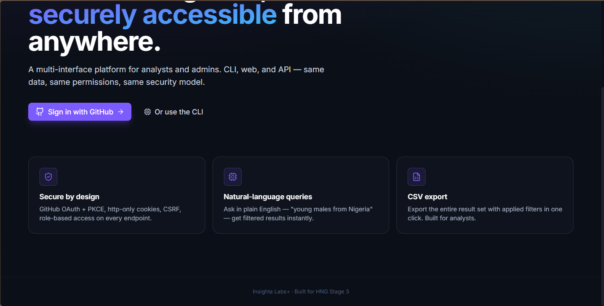
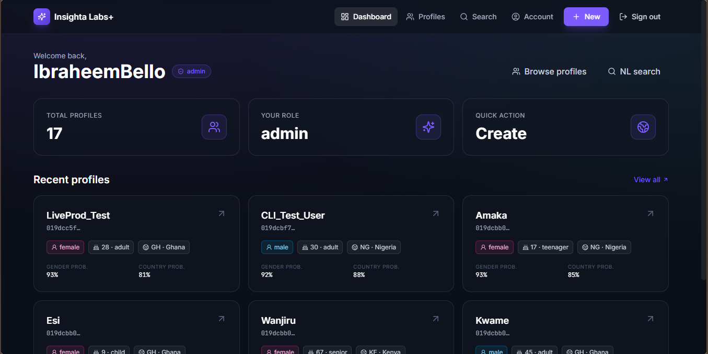
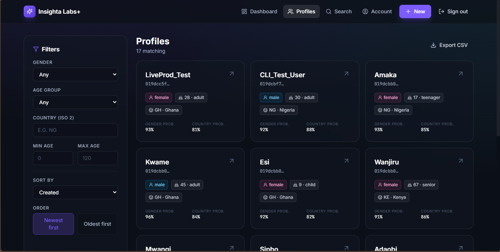

# Insighta Labs+ — Web Portal

> Next.js 15 web portal for **Insighta Labs+**. GitHub OAuth + PKCE login, role-aware UI, http-only cookie sessions, CSRF on mutating requests.

[](https://github.com/ibraheembello/HNG-Stage3-Web/actions/workflows/ci.yml)


## 🌐 Live URL

https://insighta-web-eta.vercel.app

## 📦 Sibling repositories

| Repo | Purpose |
|---|---|
| 🌐 **HNG-Stage3-Web** (this) | Next.js + Tailwind web portal |
| 🔵 [HNG-Stage3-Backend](https://github.com/ibraheembello/HNG-Stage3-Backend) | Express + Prisma API · OAuth + RBAC + CSV |
| 💻 [HNG-Stage3-CLI](https://github.com/ibraheembello/HNG-Stage3-CLI) | Globally-installable Node CLI |

---

## 🖼 Screenshots

| Landing — hero & sign-in | Landing — feature highlights |
|---|---|
|  |  |

| Dashboard (admin) | Profiles list with filters |
|---|---|
|  |  |

| Natural-language search | Account |
|---|---|
|  |  |

---

## ✨ What's inside

- **Single-origin via Next.js rewrites** — every `/api/*` call is server-proxied to the AWS backend. The browser sees one origin, so http-only cookies, `SameSite=Lax`, and CSRF all just work without cross-domain gymnastics.
- **Role-aware UI** — admins see the **+ New** profile button; analysts don't. Server-side `requireRole('admin')` on the backend is the source of truth; the UI just hides what the user can't act on.
- **Auto token refresh** — the `apiFetch` wrapper retries `401` responses through `/auth/refresh` and re-issues the original request. No mid-session bounce to login.
- **CSRF protection** — `apiFetch` reads the `csrf_token` cookie and attaches `X-CSRF-Token` to every mutating request. The backend's `csrfProtection` middleware does double-submit verification with HMAC-signed tokens.
- **Accessible, animated** — Framer-motion page transitions, route-change pill in the nav, animated probability bars on profile detail. Tailwind responsive breakpoints all the way down to mobile.
- **No dependency on AWS-only env vars at build time** — `INSIGHTA_API_BASE` is read at runtime config, so previewing against a different backend (e.g. local) is `INSIGHTA_API_BASE=… npm run dev`.

---

## 🏗 Architecture

```
app/
├── layout.tsx              # root layout, fonts, theme
├── page.tsx                # landing + sign-in initiator
├── dashboard/page.tsx      # welcome banner + stat cards + recent profiles
├── account/page.tsx        # user profile + sign out
└── profiles/
    ├── page.tsx            # list with filter sidebar + pagination
    ├── search/page.tsx     # NL search with example chips
    ├── new/page.tsx        # admin-only create form
    └── [id]/page.tsx       # detail view with animated confidence bars
components/
├── Navbar.tsx              # active-pill via framer-motion layoutId
├── AuthGate.tsx            # redirects to landing if no session
├── PageShell.tsx           # entrance animation wrapper
├── ProfileCard.tsx
├── ProfileFilters.tsx      # gender / age-group / country / age range / sort
├── Pagination.tsx
├── RoleBadge.tsx
├── EmptyState.tsx
└── LoadingScreen.tsx
lib/
├── api.ts                  # fetch wrapper · X-API-Version · CSRF · auto-refresh on 401
├── useUser.ts              # SWR hook around /auth/me
└── types.ts                # User · Profile · PaginatedEnvelope · ...
next.config.js              # /api/:path* → ${INSIGHTA_API_BASE}/api/:path*
```

### How the rewrite makes cookies work

```
Browser → vercel.app/api/v1/profiles
       ↳ Next.js rewrite (server-side) → pep3ec3gaj…awsapprunner.com/api/v1/profiles
                                       ↳ Set-Cookie: access_token=…; HttpOnly; Secure; SameSite=Lax
       ← cookie scoped to vercel.app ✅
```

Because the browser only ever talks to `vercel.app`, the cookie ends up first-party. Cross-domain CORS / SameSite / `credentials: 'include'` issues are sidestepped entirely.

---

## ⚡ Run locally

### Prerequisites
- Node.js ≥ 20
- A reachable backend (the production AWS URL works fine, or run the [backend repo](https://github.com/ibraheembello/HNG-Stage3-Backend) locally on `:8787`)

### Install + run
```bash
git clone https://github.com/ibraheembello/HNG-Stage3-Web.git
cd HNG-Stage3-Web
npm install
cp .env.example .env.local
npm run dev          # http://localhost:3000
```

### `.env.local`
```bash
INSIGHTA_API_BASE=https://pep3ec3gaj.us-east-1.awsapprunner.com
# or for a local backend:
# INSIGHTA_API_BASE=http://localhost:8787
```

### Build for production
```bash
npm run build
npm start            # http://localhost:3000 (next start)
```

> ⚠️ **Local sign-in note** — the production backend sets `Secure` cookies, which browsers reject over `http://localhost`. Local dev sign-in works only when you point `INSIGHTA_API_BASE` at a backend running with `COOKIE_SECURE=false`. Against the live AWS backend, the live Vercel deploy is the way to test the full OAuth round-trip.

---

## 🚢 Deployment — Vercel

Trivial because Vercel auto-detects Next.js.

1. https://vercel.com → **Add New → Project** → import `HNG-Stage3-Web`.
2. Framework preset: **Next.js** (auto-detected).
3. Add **environment variable**:
   - Name: `INSIGHTA_API_BASE`
   - Value: `https://pep3ec3gaj.us-east-1.awsapprunner.com`
   - Environment: **Production and Preview**
4. Click **Deploy**.

After the deploy is **Ready**:
- Update the GitHub OAuth App's **Authorization callback URL** to `https://<your-vercel-domain>/api/v1/auth/github/callback`.
- Update the backend's `GITHUB_OAUTH_CALLBACK_URL` env var to the same URL.

Subsequent pushes to `main` deploy automatically.

---

## 🧪 CI

GitHub Actions runs on every push:
1. `npm ci`
2. `npm run build` (which type-checks)

Workflow: [`.github/workflows/ci.yml`](.github/workflows/ci.yml).

---

## 🎨 Design system

- **Dark glass** aesthetic — radial gradient backdrop, `backdrop-blur-xl` glass cards, Inter + JetBrains Mono fonts.
- **Accent palette** — purple `#7c5cff` for actions, sky blue for analyst-friendly UI, green for analyst role badge, pink/sky for gender chips.
- **Motion** — Framer-motion `layoutId` for the active-route pill in the navbar, staggered reveals for grids, animated probability bars on profile detail.

All colours and animations live in [`tailwind.config.ts`](tailwind.config.ts) and [`app/globals.css`](app/globals.css).

---

## 📝 License

MIT
